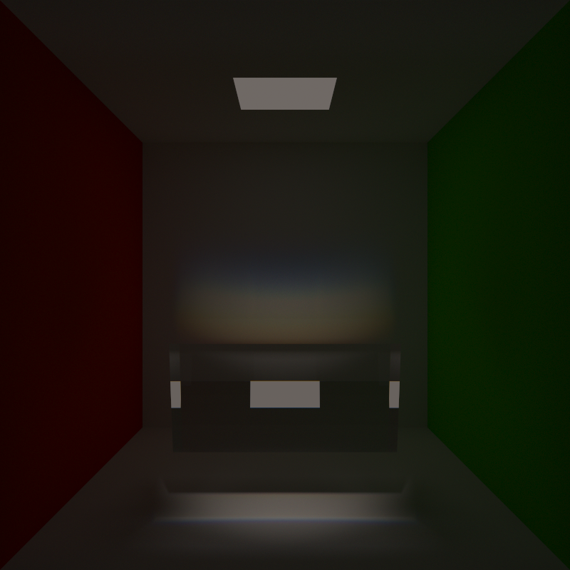
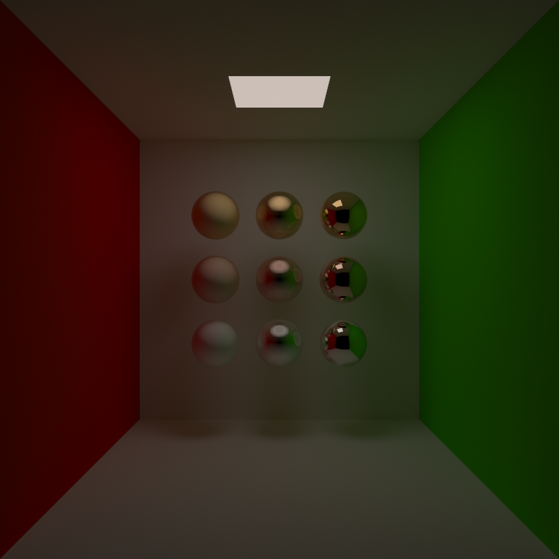
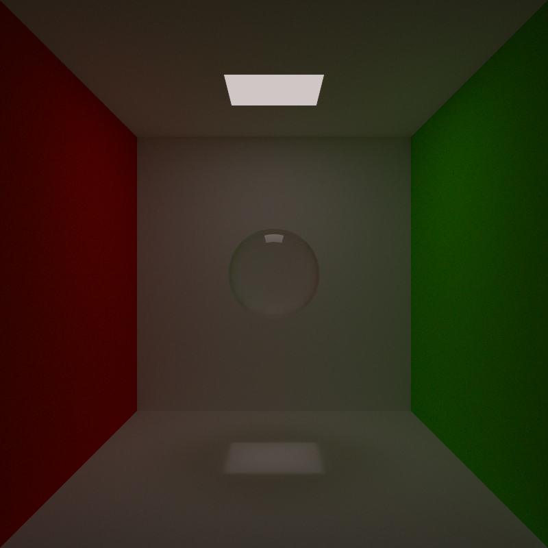

# raytracer-cpp
This project is a Monte Carlo ray tracer written in C++ with the intention of learning the language through building a project in it. This means that some of the code may not be the best C++ out there, though I did my best to follow conventions.

## Results
Below are some example renders I made.

<table>
  <tr>
    <td align="center">
      
      <br/>
      <sub>A glass prism casting a rainbow on the wall due to chromatic aberration. See the <a href="#chromatic-aberration">chromatic aberration</a> section for a detailed explanation.</sub>
    </td>
  </tr>
  <tr>
    <td align="center">
      
      <br/>
      <sub>A scene with a set of metal spheres (gold, copper, silver) with different roughness coefficients. See the <a href="#metals">metals</a> section for a detailed explanation.</sub>
    </td>
  </tr>
  <tr>
    <td align="center">
      
      <br/>
      <sub>A scene with a glass sphere. See the <a href="#dielectrics">dielectrics</a> section for a detailed explanation.</sub>
    </td>
  </tr>
</table>

## Features
The goal of this ray tracer was to get as close to physical reality as possible without sacrificing too much performance. However, since I was not running everything on the GPU, it was never really possible to make it run in real time. Being willing to wait several minutes for a decent image unlocks a lot of possibilities. Just running a Monte Carlo raytracer in real time without getting noisy outputs would be incredibly difficult, especially for complex scenes.

### Monochromatic rays
The whole scene is traced using rays with a single wavelength/frequency assigned to them. This allows for rendering of different wavelength-dependent phenomena, most notably using different indices of refraction for different wavelengths. For dielectrics, this causes chromatic aberration, while for metals it gives them their actual colour (by using complex indices of refraction).

#### Chromatic aberration
This phenomenon occurs when a dielectric medium had a different index of refraction for each wavelength. This is generally true for all materials due to the physics of light-material interactions, but this dependence is often minimal. However, there is one consequence of this phenomenon that everyone will be familiar with, and that is rainbows. Thanks to support for dispersion formulas for dielectrics, this renderer is able to produce images of rainbows.

### Bounding volume hierarchy
A basic bounding volume hierarchy using axis-aligned bounding boxes is implemented. This way the renderer can handle up to hundreds of thousands of objects while still being responsive (there is, of course, a performance drop, but the cost increases in a logarithmic manner instead of linearly).

### Materials
The ray tracer has support for basic materials which can be assigned to objects. Most of them directly correspond to something from the physical world, but I did add a few helper materials to make scene assembly easier.

#### Dielectrics
Dielectrics are characterised by their colour (a "cheat" to produce coloured glasses etc.) and dispersion coefficients for calculating the index of refraction. The full Fresnel's equations are evaluated for accurate reflection/refraction ratios.

#### Diffuse
This material represents a perfectly diffuse one, which follows lambertian reflectance. Characterised by its colour.

#### Lights
There are three light source materials: `Light`, `BlackBody`, and `DirectedEmitter`. All of them are what their names suggest:
 - `Light` is a generic light characterised by its RGB colour.
 - `BlackBody` is a light source characterised by its temperature, whose spectrum follows the Planck's law.
 - `DirectedEmitter` is a wrapper of the above types, which restricts the directions in which they emit light, acting as a directional light source. This avoids the need for having a normal light source with a long tube attached to it to block off the unwanted directions.

#### Metals
Similar to dielectrics, but characterised by its roughness and a list of wavelength to complex index of refraction mappings. The colour is obtained by evaluating Fresnel's equations using those complex indices of refraction and assuming all of the "refracted" light is absorbed (which is a decent approximation for objects which are not extremely thin).

#### Mirrors
A perfectly reflective material characterised by its colour. Mostly a helper material to have something perfectly reflective and not have to construct a perfectly polished metal with the desired indices of refraction.

## TODOs
There are a few missing features which I would like to implement at some point:
 - Scattering: Allow dielectric materials to be characterised by the mean free path between scattering events and some coefficient which would dictate the scattering directions distribution.
 - Better BVH: Currently the splits made in the construction of the BVH are often suboptimal. Adding a heuristic which would split such that the sum of volumes times the number of primitives in each of those volumes would be minimised would allow for better performance.
 - Loading models: Currently there is no way to load a model and render it, all scenes have to be assembled by hand.

## Compiling
The project uses CMake along with the `vcpkg` package manager and requires C++23. 

If you are using Visual Studio Code, the project can be easily built and run by pressing `Shift`+`F5` (assuming your environment is configured for CMake).

Alternatively, you can build it from the command line. Ensure you pass the path to your vcpkg toolchain file if you do not have the `VCPKG_ROOT` environment variable set.
```
cmake -B build -S . -DCMAKE_TOOLCHAIN_FILE="%VCPKG_ROOT%\scripts\buildsystems\vcpkg.cmake"
cmake --build build --config Release
```

### Dependencies
The project relies on the following libraries (handled via `vcpkg` and git submodules):
 - `sdl2`: For displaying the render window.
 - `stb`: For saving the output PNG images.
 - `rgb2spec`: For handling the conversion from RGB to spectra which produce this RGB colour (up to the metamer ambiguities).

## Usage
Scene assembly is currently done directly in the C++ code. Once you define your scene and recompile the project, the rendering will begin immediately upon running the executable.
 - Saving: Press the `s` key to save the current image and the raw data to files named with the current Unix timestamp.
 - Resuming: To resume rendering from a previous state, change the target file name in `settings.hpp` to match an existing save file (without the file extension). This is useful for complex scenes that take a while to converge without noise, allowing you to pause and resume the Monte Carlo rendering process.